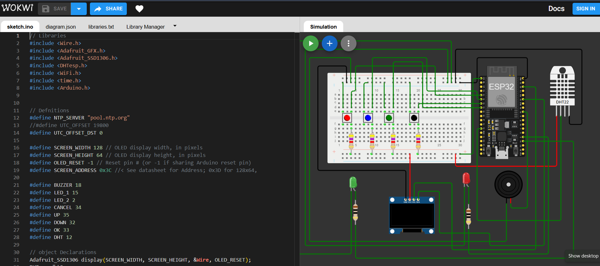

# Med Box Project

## Overview
The Med Box project is designed to monitor the temperature and humidity conditions of medicine storage. It ensures that medicine remains in a safe environment and reminds the patient to take their medicine along with an alert from a buzzeraat the right time. 

## Features
- **Temperature and Humidity Monitoring**: Continuously tracks the temperature and humidity where the medicine is stored.
- **Buzzer Alert**: Provides an audible alert when the patient needs to take their medicine or when unsafe conditions (high temperature/humidity) are detected.
- **Real-Time Monitoring**: Keeps real-time data of temperature and humidity, ensuring that the environment stays within safe ranges for medicine storage.

## Components
- **Microcontroller**: ESP32
- **Sensors**: DHT11 sensor (for measuring temperature and humidity)
- **Buzzer**: A small buzzer to notify the patient to take medicine and ring alaram.

  

## Link to my online stimulation
 - https://wokwi.com/projects/426694927306995713
  
---
