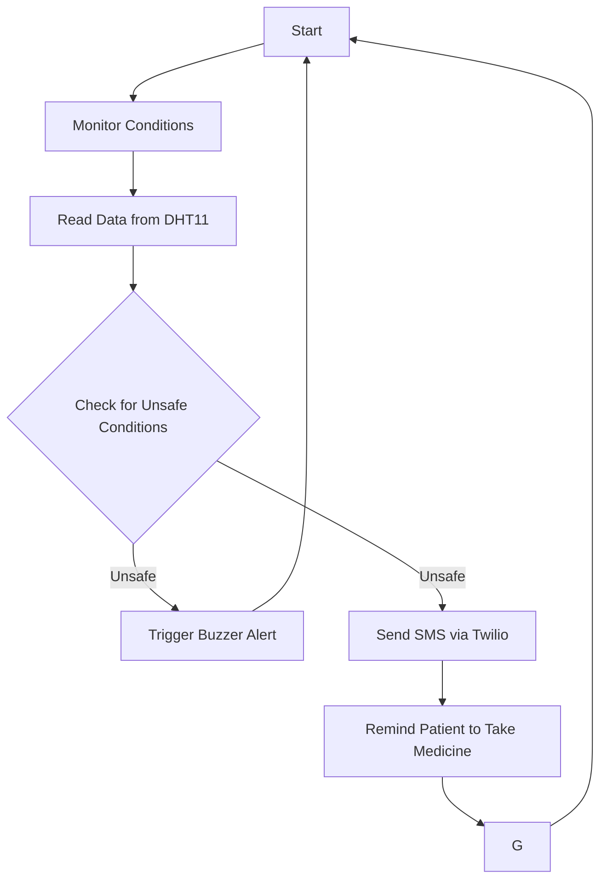

# Med Box Project

## Overview
The Med Box project is designed to monitor the temperature and humidity conditions of medicine storage. It ensures that medicine remains in a safe environment and reminds the patient to take their medicine at the right time. If the patient is far away, the system can send an SMS notification using Twilio, along with an alert from a buzzer.

## Features
- **Temperature and Humidity Monitoring**: Continuously tracks the temperature and humidity where the medicine is stored.
- **Buzzer Alert**: Provides an audible alert when the patient needs to take their medicine or when unsafe conditions (high temperature/humidity) are detected.
- **Twilio SMS Notifications**: Sends an SMS message to the patient's phone if they are away and need to take their medicine or when conditions are not ideal.
- **Real-Time Monitoring**: Keeps real-time data of temperature and humidity, ensuring that the environment stays within safe ranges for medicine storage.

## Components
- **Microcontroller**: Raspberry Pi or Arduino (for controlling the sensors and logic)
- **Sensors**: DHT11 or DHT22 sensor (for measuring temperature and humidity)
- **Buzzer**: A small buzzer to notify the patient to take medicine.
- **Twilio API**: A service that sends SMS reminders to the patient's phone.
- 
## Workflow

---
